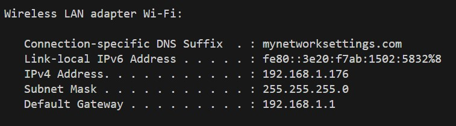

# GSTK backend
Backend code for [GSTK](https://skywolf829.github.io/GSTK/).
Contains the gaussian model, training, datasets, and communicating with GUI.

# Installation

This section covers the installation procedure for just the backend code. 
Your system should have a CUDA capable graphics card.


## Prerequisites
- [CUDA Toolkit](https://developer.nvidia.com/cuda-toolkit-archive).
We have tested with v11.8 and v12.1 on Windows 11.
Ensure the environment's `PATH` variable is updated to include the `bin` folder of the installed CUDA toolkit.
- [Conda](https://docs.anaconda.com/free/miniconda/) package manager.
This will install Python and the required Python packages to run the server.
We use Miniconda on Windows 11.
- [COLMAP](https://colmap.github.io/index.html) (optional). 
Required if you'd like to process your own images into a dataset to train a model with.
We highly recommend installing with CUDA support for quicker processing times.

If you run into any issues, there are a few sources with helpful installation instructions.


## Conda installation
From a terminal, invoke:

```
conda env create -f env.yml
```

It may take some time to download all packages, install, and compile the CUDA code.
 

# Running the code

We provide instructions for 3 use cases depending on where your server device is (running this code) and the viewing device is (looking at https://skywolf829.github.io/GSTK/).

If you already know what you'd like, the following command can be run.

```
conda activate GSTK
python src/backend.py --ip <your.ip.address.here> --port <open_port_number>
```

## Running server and website on same computer

If you are running the server on the same machine you plan on viewing/editing on (default case), you can use the default settings, and simply run:

```
python src/backend.py
```

## Running for access from devices on your local network
If you plan on running the server on one machine, and viewing the web browser on another (your laptop, another PC, etc), then you'll need to find your LAN IP address.

On Windows, you can type `ipconfig` into your console.
Look for your LAN address - it probably looks something like this:

 

If you plan on running this server on a PC somewhere, and then accessing it from a laptop elsewhere
If your server is remote, find the servers public IP address and ensure a port is forwarded properly.
Then, use that specific IP and port for connection.

# Known Issues

1. WGPU fails on WSL2 and Kaggle systems.
Currently no solution, but Google Colab does work!

# Frequent Problems

1. Installing the CUDA packages during the `conda env create ...` fails.
Usually due to the system not knowing where you installed the CUDA toolkit. 
Ensure your `PATH` variable contains the `bin` folder of the CUDA toolkit. 
This [YouTube video](https://www.youtube.com/watch?v=UXtuigy_wYc) may point out how to set this up clearly.